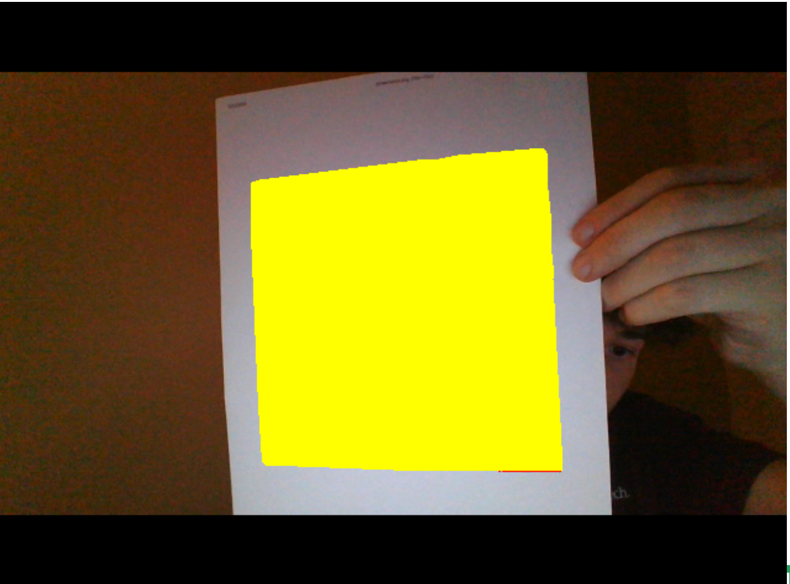

# SUDOKU SOLVER

NOTE: This is NOT an original project. The concept for the project has already been created, and the project has already been open-sourced. This is merely an attempt to recreate it in my own repository. Large portions of the code, as well as a pre-trained neural network, were taken directly from repositories who have been listed in the references section, where you will find other resources that heavily inspired the code that I did write myself. I do not claim this code, or this project to be my own. This repository is meant to provide instructions and code to get a project of this type up and running.

# SETUP & INSTRUCTIONS

*This is just one possible method to set up and run this project.*

**Step 1: Download Python:** 
In order to run this project, python will have to be installed on your device. You can quickly do this by going [here](https://www.python.org/downloads/) and clicking on the big yellow button which says "Download Python". Make sure you download the correct version for your operating system, and install the downloaded file.

**Step 2: Download Anaconda:**
Anaconda is a python interface which I recommend using to set up this project. You can find it [here](https://www.anaconda.com/products/individual). This will allow you to quickly install the necessary python libraries for this project, and launch the Jupyter Notebook environment.

**Step 3: Install Libraries via Anaconda Prompt:**
There are a few python libraries which need to be installed in order to run this project. Luckily, this is an easy task with Anaconda. Open up the anaconda prompt, a program which should be on your computer after downloading Anaconda. This will open up a program which looks like command prompt/terminal. First we want to install the python linear algebra toolkit, numpy, which can be accomplished by simply entering the command 

    conda install numpy
    
Next we want to install our opencv (computer vision) library. This can be accomplished by typing the following command into anaconda prompt:

    conda install -c conda-forge opencv
    
If reaching this point has led to confusion, [this](https://medium.com/@pranav.keyboard/installing-opencv-for-python-on-windows-using-anaconda-or-winpython-f24dd5c895eb) is a great article detailing how to get opencv installed via anaconda step-by-step with screenshots
    
Now, in order to utilize the convolutional neural network we will be using for number classification, we need to install the python neural network library Keras, which can be done again by typing into anaconda prompt:

    conda install -c anaconda keras
    
Great! Now we have successfully installed the necessary libraries.

**Step 4: Launch Jupyter Notebooks:**
Open up the Anaconda Navigator program which should have been downloaded with Anaconda. Under the home tab, you will see a list of boxes, each of which contains a different python environment. Click on the "launch" box within the larger box entitled "Jupyter Notebooks", which looks like this: 

This should open up your browser with a folder directory (for windows this is typically your user folder in your C drive).

**Step 5: Paste in code and models to local folder within Jupyter:**
The simplest way to proceed in this step is to navigate to wherever you would like this project to reside on your computer within the Jupyter browser directory, and create a folder for this project. Then simply download the files from this repository, and place them in the folder you've created. 

**Run code, put grid in front of camera:**
The final step is to open up the main.ipynb file and click run. If you have a functioning webcam, a new window should open up displaying your video feed. Print out ne of the sample sudoku grids provided, or one of your own, and hold it up to the camera (relatively upright, with a steady hand) and the solved numbers should be printed out on the grid in the video feed.

# BACKGROUND

# Computer Vision Overview
Computer vision is the field concerning the ability of a computer to process photo or video input that it receives from a visual sensor. This is accomplished by converting an image into an array of tuples of three pixels with values between 0 and 255 (representing the RGB color system), and representing a video as a set of images which continually change to reflect the current frame. This array can then be manipulated for a variety of purposes, including motion detection, object classification, filter application, among many others. The use of Python’s opencv library for computer vision which operates on top of Python’s numpy library for linear algebra makes computer vision tasks much simpler than they otherwise would be. 

# SUDOKU PROJECT OVERVIEW
I was tasked to reverse engineer code which takes a video of someone holding up a sudoku puzzle as the input, and prints out the exact same video with the entire grid filled in with the solved puzzle. This is a complex task, but it can be thought of in three manageable steps. 

**1.** From the raw video input, isolate the portion of the frame containing the sudoku grid and transform it so it's upright.
**2.** From the grid image, grab the portion of each nonempty box containing the number, and run this image through a digit classifying CNN to receive the digit in the box in order to fill out a matrix with each number on the grid. 
**3.** Using a known Sudoku algorithm, solve this matrix and print out the numerical solutions into their respective spots on the sudoku grid, undo the grid transformation, and return this image to the user.

Each of these steps are critical to this particular use case of opencv, but in order to modify this code to fit a different object classification use case, step 2 (and, to a lesser degree, step 1) is the most critical to understand. 

# SUDOKU GRID DETECTION

The first step is to find the contour, or region of the frame which contains the sudoku grid. Below is the code I used to draw this contour. (NOTE: While the creator’s github was consulted for ideas and certain opencv methods, all code here is original)

    import cv2, time
    import numpy as np
    video = cv2.VideoCapture(0)

    x = 1

    while True:
        check, frame = video.read()
        frame = frame
        frame = cv2.cvtColor(frame,cv2.COLOR_BGR2GRAY)
        frame = cv2.GaussianBlur(frame,(5,5),0)
        frame = cv2.adaptiveThreshold(frame, 255, cv2.ADAPTIVE_THRESH_GAUSSIAN_C, cv2.THRESH_BINARY, 15, 5)
        image, contours, hierarchy = cv2.findContours(frame, cv2.RETR_TREE, cv2.CHAIN_APPROX_SIMPLE)
   
        maxA = -1
        maxC = None
        secA = -1
        secC = None
   
        for f in contours:
            if cv2.contourArea(f) > maxA:
                maxA = cv2.contourArea(f)
                maxC = f
            elif cv2.contourArea(f) > secA:
                secA = cv2.contourArea(f)
                secC = f

        big = [1]
        big[0] = secC
        print(secC)

        check, frame2 = video.read()
        final = cv2.drawContours(frame2, big, -1, (0,0,255),1)
        cv2.imshow('final',final)
        key = cv2.waitKey(1)
        if key == ord('x'):
            break
    video.release()
    cv2.destroyAllWindows

In short, I set up a loop to constantly be grabbing new camera frames, thus creating a real time video. Then, I took each individual frame and converted it to a black and white image to make image processing possible. Then I applied Gaussian blurring in order to remove image noise, and adaptive Gaussian thresholding to mark tangible “edges” in the photo. I then found all of the contours, which are essentially just the boundary of closed regions formed from these edges. Because the entire frame was being counted as one big contour, I wrote code to grab the second biggest contour, and then to draw this back on the original frame.

After this I grabbed the polygon encompassed by the grid with the lines

    poly = cv2.approxPolyDP(secC, 1, True)
    cv2.fillConvexPoly(final, poly, (0,255,255), 1)
    Which yields the image below

After this, the rotated rectangle of the grid must be mapped to an upright rectangle in order for number classification to occur, so we have to use the warpperspective() function to accomplish this. In a use case such as the one you described to me, this may not be necessary, but some form of rotating an object to get the proper perspective is indeed important in object classification.

# NUMBER DETECTION (THIS IS THE CRITICAL STEP FOR AR USE CASE)

There are some minutiae in the beginning of this phase of the project as the grid needs to be sliced into its different boxes and the lines between the numbers ignored, but this portion of the code is specific just to sudoku and won’t be necessary for other use cases. I have pasted the code in this section below, and will offer a brief explanation of its parts, but what’s important is what happens after these boxes have been compartmentalized.  Each image of a number is “looked” at by the computer, input into a convolutional neural network, and output as a digit between 0-9. The beauty of this process is that the fact that this is happening in real time is no obstacle, as each individual frame is looked at separately, and its grid located and numbers classified instantaneously.  Each still image will run images through the neural network and receive numbers. The accuracy of this type of numerical classification is over 99%, and this is owed in large part to the power of the convolutional neural network. 

# MODIFICATIONS
So how can code like this be adapted for a different type of object classification? Most of the body of this code can remain the same. We will continue to need a sequential model with convolutional layers and then a flattening into additional “normal” dense hidden layers, all with the efficient relu activation. Depending on the size of what we’re doing it might be very helpful or even necessary to include pooling layers, and dropping a proportion of the neurons is always important to prevent overfitting. What will change then will of course be the labeled dataset we are using to train the network, and perhaps also the size of the image we enter into the network. The number of output modes which the final softmax function will sort images into is again entirely dependent on the use case, and how many categories of objects the network is meant to classify. The size of the kernels/filters we use for convolution, the number of layers and neurons, the proportion we choose to drop in each layer, when we flatten, our optimizer, and other hyperparameters will be adjusted per the use case and will be optimized via a grid search when the time comes. With a good labeled dataset and the use of a CNN with opencv, real time object classification should be possible.

# SUDOKU SOLVE
This portion of the project is the least applicable to a different AR, so I have not written any new code here. In a different use case, this step would be replaced with something different, whether it’s printing the name of an object on the screen, showing other related objects, etc. For Sudoku however, the augmented reality environment is completed by running a known recursive algorithm for solving Sudoku, and then printing the correct numbers in the correct locations on the grid.

# REFERENCES

